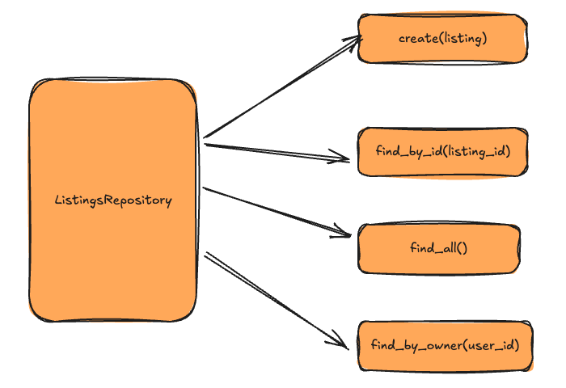
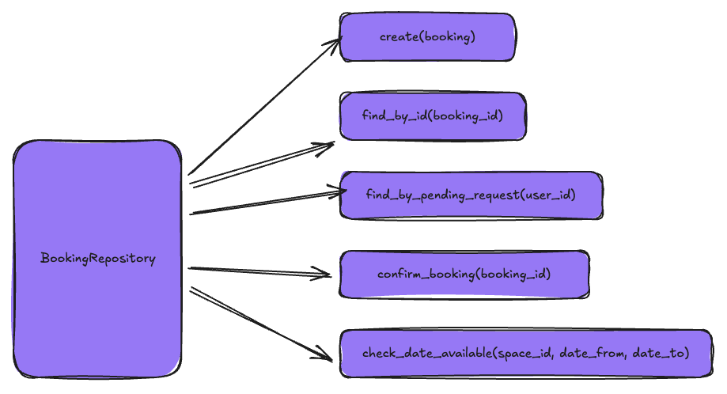

# MakersBnB - Veni

## Database Design


### Table Overview
```bash
Table: users
id | email | password | name | created_at

Table: listings
id | user_id (fk) | name | description | price_per_night | created_at

Table: bookings
id | listing_id (fk) | guest_id (fk) | date_from | date_to | status | created_at


```

### SQL Seeds

Your tests will depend on data stored in PostgreSQL to run.

If seed data is provided (or you already created it), you can skip this step.

```sql
DROP TABLE IF EXISTS users CASCADE;
DROP TABLE IF EXISTS listings CASCADE;
DROP TABLE IF EXISTS bookings CASCADE;


CREATE TABLE users (
    id SERIAL PRIMARY KEY,
    email VARCHAR(255),
    password VARCHAR(255),
    name VARCHAR(255),
    created_at TIMESTAMP DEFAULT CURRENT_TIMESTAMP
);

CREATE TABLE listings (
    id SERIAL PRIMARY KEY,
    user_id INTEGER,
    name VARCHAR(255),
    description TEXT,
    price_per_night INTEGER,
    CONSTRAINT fk_user_id FOREIGN KEY(user_id) REFERENCES users(id) ON DELETE CASCADE
);

CREATE TYPE booking_status AS ENUM ('pending', 'confirmed', 'rejected');

CREATE TABLE bookings (
    id SERIAL PRIMARY KEY,
    listing_id INTEGER,
    guest_id INTEGER,
    date DATE,
    status booking_status DEFAULT 'pending',
    created_at TIMESTAMP DEFAULT CURRENT_TIMESTAMP,
    CONSTRAINT fk_listing_id FOREIGN KEY(listing_id) REFERENCES listings(id) ON DELETE CASCADE,
    CONSTRAINT fk_guest_id FOREIGN KEY(guest_id) REFERENCES users(id) ON DELETE CASCADE
);

```

Run this SQL file on the database to truncate (empty) the table, and insert the seed data. Be mindful of the fact any existing records in the table will be deleted.

```bash
psql -h 127.0.0.1 makersbnb_veni < seeds/makersbnb.sql
```

## Class Interfaces
### Class Definitions
**Models**
```python
# (in lib/user.py)
class User

# in lib/listing.py
class Listing

# in lib/booking.py
class Booking
```

**Repositories**
```py
# Repository class
# (in lib/user_repository.py)
class UserRepository

# in lib/listing_repository.py
class ListingRepository

# in lib/booking_repository.py
class BookingRepository

```

### Model Class Implementations
```py
# (in lib/user.py)

class User:
    def __init__(self, id, name, email, password, created_at=None):
        self.id = id
        self.name = name
        self.email = email
        self.password = password
        self.created_at = created_at

    def __eq__(self, other):
        return self.__dict__ == other.__dict__
    
    def __repr__(self):
        return f"User ({self.id}, {self.name}, {self.email}, {self.password}, {self.created_at})"
```

```py
# in lib/booking.py
class Bookings:
    def __init__(self, id, listing_id, guest_id, date, status, created_at=None):
        self.id = id
        self.listing_id = listing_id # FK
        self.guest_id = guest_id # FK
        self.date = date
        self.status = status
        self.created_at = created_at


    def __eq__(self, other):
        return self.__dict__ == other.__dict__
    
    def __repr__(self):
        return f"Booking ({self.id}, {self.listing_id}, {self.guest_id}, {self.date}, {self.status}, {self.created_at})"
```

```py
# in lib/listing.py
class Listing:
    def __init__(self, id, user_id, name , description,  price_pernight, created_at=None):
        self.id = id
        self.user_id = user_id # FK
        self.name = name
        self.description = description
        self.price_pernight = price_pernight
        self.created_at = created_at

    def __eq__(self, other):
        return self.__dict__ == other.__dict__
    
    def __repr__(self):
        return f" Listing ({self.id}, {self.user_id}, {self.name} , {self.description},  {self.price_per_night}, {self.created_at})"
```

### Repository Class Implementation

```py
# (in lib/user_repository.py)

class UserRepository:
    def __init__(self, connection):
        self._connection = connection

    def all(self):
        # Executes the SQL query:
        # SELECT * FROM users;

        # Returns all user records
        pass

    def find_by_id(self, user_id):
        # Executes the SQL query:
        # SELECT *  FROM users WHERE id = %s;

        # Returns a single User object by id
        pass

    def find_by_email(self, email):
        # Executes the SQL query:
        # SELECT *  FROM users WHERE email = %s;

        # Returns a single User object by email
        pass

    def create(self, user):
        # Executes the SQL query:
        # INSERT INTO users (id, name, email, password , created_at)
        # VALUES(%s, %s, %s, %s, %s ),
        # [user.id, user.name, user.email, user.password, user.created_at];

        # Creates a new User
        pass
```


```py
# (in lib/listing_repository.py)

class ListingRepository():

    def all(self):
        # Executes the SQL query:
        # SELECT * FROM listings;

        # Returns an array of Listing objects
        pass

    def find_by_id(self,listing_id):
        # Executes the SQL query:
        # SELECT * FROM listings WHERE id = %s;

        # Returns a single Listing object by id
        pass
    
    def find_by_owner(self,user_id):
        # Executes SQL query:
        # SELECT * FROM listings WHERE user_id = %s;

        # Returns a list of Listing objects by user_id foreign key
        pass

    def create(self, listing):
        # Executes SQL query:
        # INSERT INTO listing (id, user_id, name, description, price_per_night, created_at)
        # VALUES (%s, %s, %s, %s, %s, %s)

        # Creates a new Listing object
        pass
```


```py
# (in lib/booking_repository.py) 

class BookingsRepository():

    def all(self):
        # Executes the SQL query:
        # SELECT * FROM bookings;

        # Returns all records
        pass

    def find_by_id(self, booking_id):
        # Executes SQL query:
        # SELECT * FROM bookings WHERE id = %s;

        # Returns single Booking object by id
        pass

    

    def find_pending_requests_for_owner(self, owner_id):
        # SELECT bookings.* FROM bookings
        # JOIN listings ON bookings.listing_id = listings.id
        # WHERE listings.user_id = %s AND bookings.status = 'pending'

        # Returns all pending Booking objectd
        pass

    def check_date_available(self, listing_id, date):
        # Executes SQL query:
        # SELECT * FROM bookings
        # WHERE listing_id = %s
        # AND date = %s
        # AND status = 'confirmed'

        # Returns boolean value - True if available, False if not
        pass
        

    def create(self, booking):
        # Execute SQL query:
        # INSERT INTO bookings (id, listing_id, guest_id, date, status, created_at)
        # VALUES (%s, %s, %s, %s, %s, %s),
        # [booking.id, booking.listing_id, booking.guest_id, booking.date, booking.status];

        # Creates a new Booking object
        pass

    def confirm_booking(self, booking_id):
        # Execute SQL query:
        # UPDATE bookings
        # SET status = 'confirmed'
        # WHERE id = %s;

        # Updates the status of the Booking object to confirmed
        pass

    def reject_booking(self, booking_id):
        # Execute SQL query:
        # UPDATE bookings
        # SET status = 'rejected'
        # WHERE id = %s;

        # Updates the status of the Booking object to rejected
        pass

    def find_bookings_for_guest(self, guest_id):
        # Execute SQL query:
        # SELECT * FROM bookings WHERE guest_id = %s;

        # Returns a list of Booking objects for this guest
        pass

```

Note:
How do we pull up just the records in the bookings table that relate to the hosts properties (so they are not seeing ALL bookings) - what do we run the find search on? 
Idea 1: define whether user is host or guest, search on that user Id 
Idea 2: 2 joins, use listing_id to pull in host name 

```


## 6. Write Test Examples

Write Python code that defines the expected behaviour of the Repository class, following your design from the table written in step 5.

These examples will later be encoded as Pytest tests.

```python
# EXAMPLES

# 1
# Get all students

repo = StudentRepository()

students = repo.all()

len(students) # =>  2

students[0].id # =>  1
students[0].name # =>  'David'
students[0].cohort_name # =>  'April 2022'

students[1].id # =>  2
students[1].name # =>  'Anna'
students[1].cohort_name # =>  'May 2022'

# 2
# Get a single student

repo = StudentRepository()

student = repo.find(1)

student.id # =>  1
student.name # =>  'David'
student.cohort_name # =>  'April 2022'

# Add more examples for each method
```

Encode this example as a test.


## 7. Test-drive and implement the Repository class behaviour

_After each test you write, follow the test-driving process of red, green, refactor to implement the behaviour._